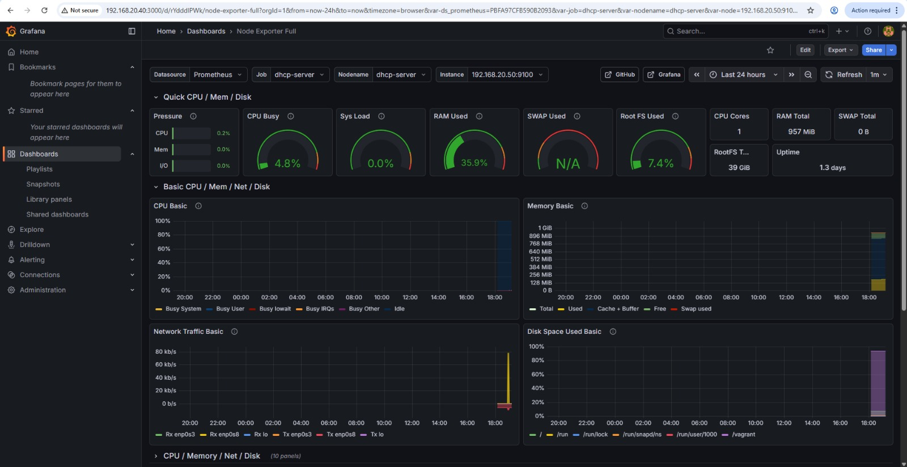
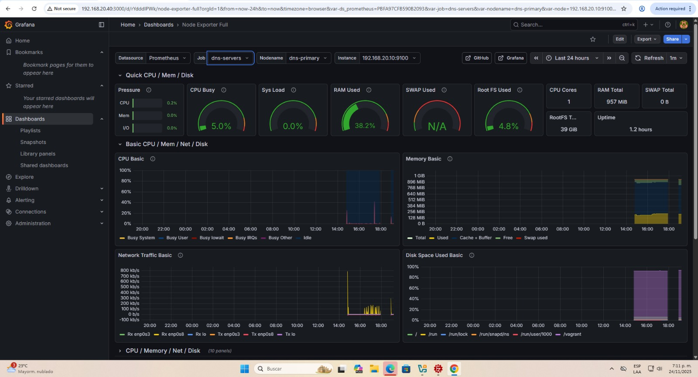
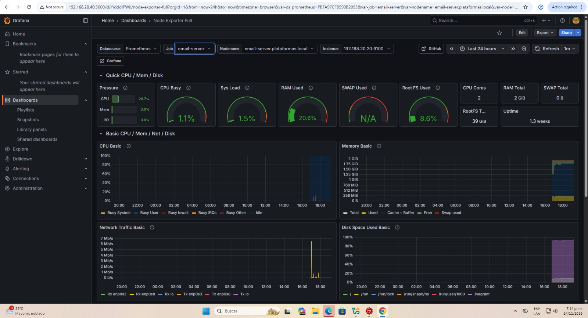
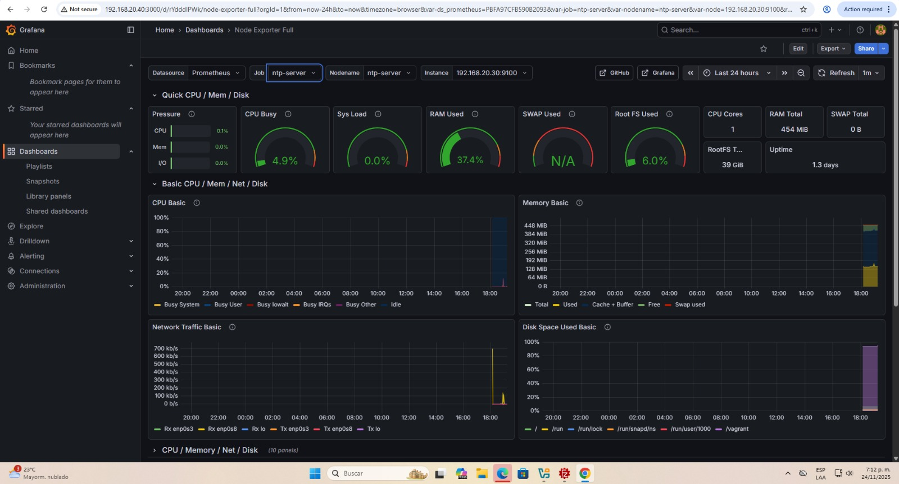
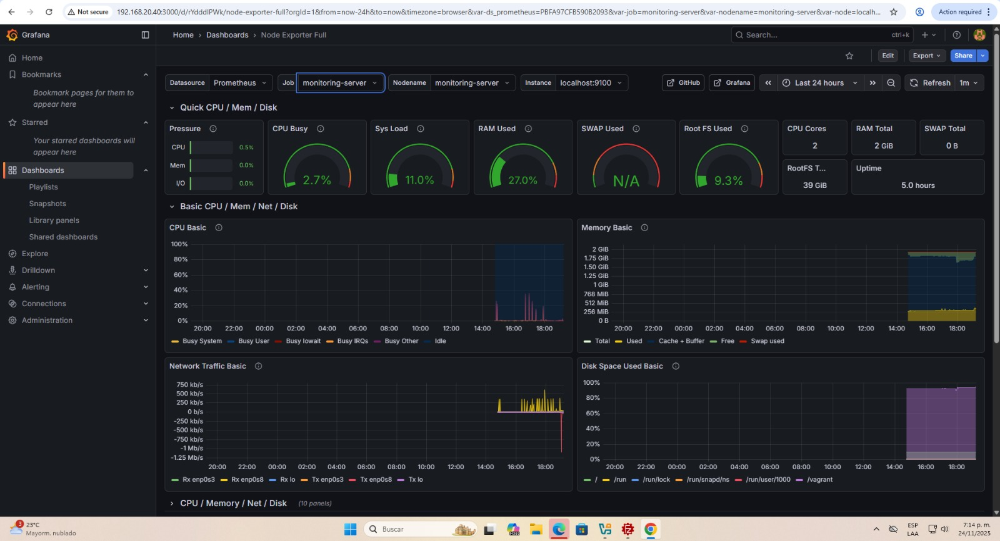
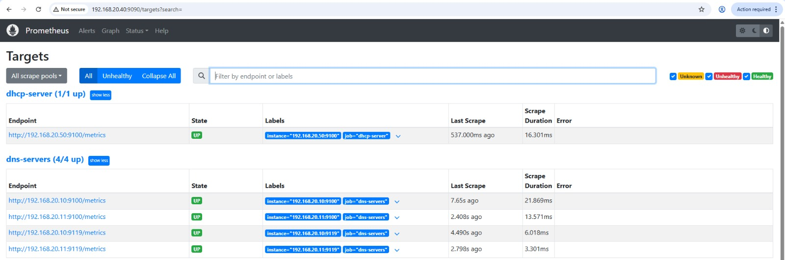
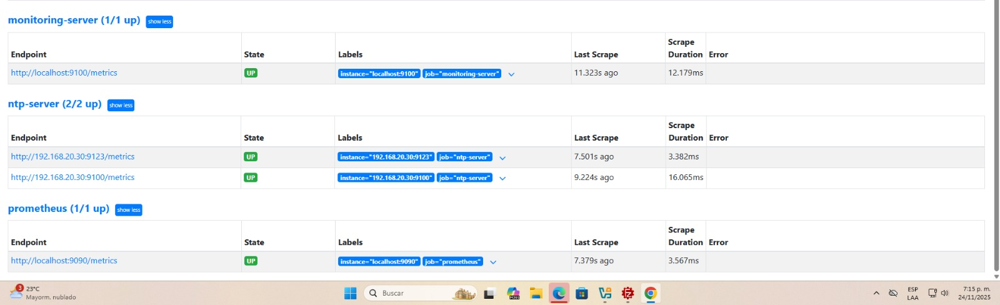

# Prometheus and Grafana Monitoring Infrastructure

A centralized monitoring solution that tracks system and service metrics across distributed infrastructure components using Prometheus for metric collection and Grafana for visualization.

**Author:** Santiago Valencia García - A00395902

**Institution:** Universidad Icesi - Administración de Plataformas I

---

## Architecture Overview

The monitoring system operates on a dedicated server that collects metrics from all infrastructure services through specialized exporters.

```
Monitoring Server (192.168.20.40)
├── Prometheus :9090 - Metrics collection and storage
├── Grafana :3000 - Dashboard visualization
└── Node Exporter :9100 - System metrics

Monitored Infrastructure:
├── DNS Servers (192.168.20.10/11)
│   ├── BIND Exporter :9119
│   └── Node Exporter :9100
├── Email Server (192.168.20.20)
│   ├── Postfix Exporter :9154
│   ├── Dovecot Exporter :9166
│   └── Node Exporter :9100
├── NTP Server (192.168.20.30)
│   ├── Chrony Exporter :9123
│   └── Node Exporter :9100
└── DHCP Server (192.168.20.50)
    └── Node Exporter :9100
```

---

## Dashboard Visualizations

### DHCP Server Dashboard
Tracks network address allocation and system resources.



### DNS Servers Dashboard
Monitors query rates, response types, and cache performance.



### Email Server Dashboard
Displays mail queue metrics, message throughput, and connection statistics.



### NTP Server Dashboard
Shows time synchronization accuracy and stratum levels.



### Monitoring Server Dashboard
Visualizes the monitoring infrastructure itself and local system metrics.



### Prometheus Target Status
The Prometheus interface displays all configured scrape targets and their health status.





---

## Prerequisites

All infrastructure VMs must be running before deployment:

```bash
# Start all infrastructure VMs
cd dns-infrastructure && vagrant up
cd email-infrastructure && vagrant up
cd ntp-infrastructure && vagrant up
cd dhcp-infrastructure && vagrant up
```

Required software:
- VirtualBox 6.0+
- Vagrant 2.2+
- Ansible 2.9+

---

## Deployment

### Start Monitoring Server

```bash
cd monitoring-infrastructure
vagrant up
```

### Configure Inventory

Update `inventory.ini` with correct credentials for each server. Default uses `vagrant` user with SSH keys.

Test connectivity:

```bash
ansible all_servers -i inventory.ini -m ping
```

### Deploy Monitoring Stack

Deploy everything at once:

```bash
ansible-playbook -i inventory.ini deploy_all.yml
```

Or deploy separately:

```bash
# Deploy Prometheus and Grafana
ansible-playbook -i inventory.ini deploy_monitoring.yml

# Deploy exporters to infrastructure servers
ansible-playbook -i inventory.ini deploy_exporters.yml
```

### Access Monitoring

- **Prometheus:** http://192.168.20.40:9090
- **Grafana:** http://192.168.20.40:3000 (login: admin/admin)

---

## Metrics Collected

### System Metrics (All Servers)
- CPU utilization and load averages
- Memory and swap usage
- Disk space and I/O
- Network statistics

### DNS Metrics
- Query rates by type
- Cache hit ratios
- Zone transfer statistics

### Email Metrics
- Message delivery rates
- Queue depth
- SMTP/IMAP connections

### NTP Metrics
- Time offset from reference
- Stratum level
- Peer synchronization status

---

## Verification

Check all exporters:

```bash
./scripts/check_exporters.sh
```

Verify Prometheus targets at http://192.168.20.40:9090/targets - all should show "UP" status.

---

## Troubleshooting

### Exporter Not Running

```bash
ssh user@192.168.20.XX
sudo systemctl status <exporter-name>
sudo journalctl -u <exporter-name> -n 50
sudo systemctl restart <exporter-name>
```

### Prometheus Issues

```bash
ssh vagrant@192.168.20.40
sudo systemctl status prometheus
sudo journalctl -u prometheus -f
```

### Grafana Shows No Data

1. Check Prometheus targets are UP: http://192.168.20.40:9090/targets
2. Verify exporter endpoints respond: `curl http://192.168.20.XX:PORT/metrics`
3. Check Grafana data source configuration

---

## Project Structure

```
monitoring-infrastructure/
├── Vagrantfile                 # Monitoring server VM
├── inventory.ini               # Server inventory
├── deploy_monitoring.yml       # Prometheus/Grafana playbook
├── deploy_exporters.yml        # Exporter deployment
├── deploy_all.yml              # Complete deployment
├── ansible/roles/              # Ansible roles
└── dashboards/                 # Grafana dashboards
```

---

## References

- [Prometheus Documentation](https://prometheus.io/docs/)
- [Grafana Documentation](https://grafana.com/docs/)
- [Prometheus Exporters](https://prometheus.io/docs/instrumenting/exporters/)
